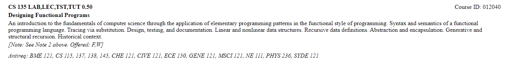
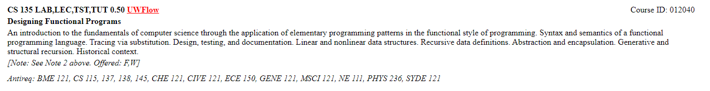

# UWFlow Extension

A simple extension that adds UWFlow links to your [undergrad calendar](https://ugradcalendar.uwaterloo.ca/page/Course-Descriptions-Index).

Selecting a subject from the course table will display all courses and their description, but sometimes you want more information from the associated 
UWFlow page for that course. This extension adds those links.

Before:

After:

